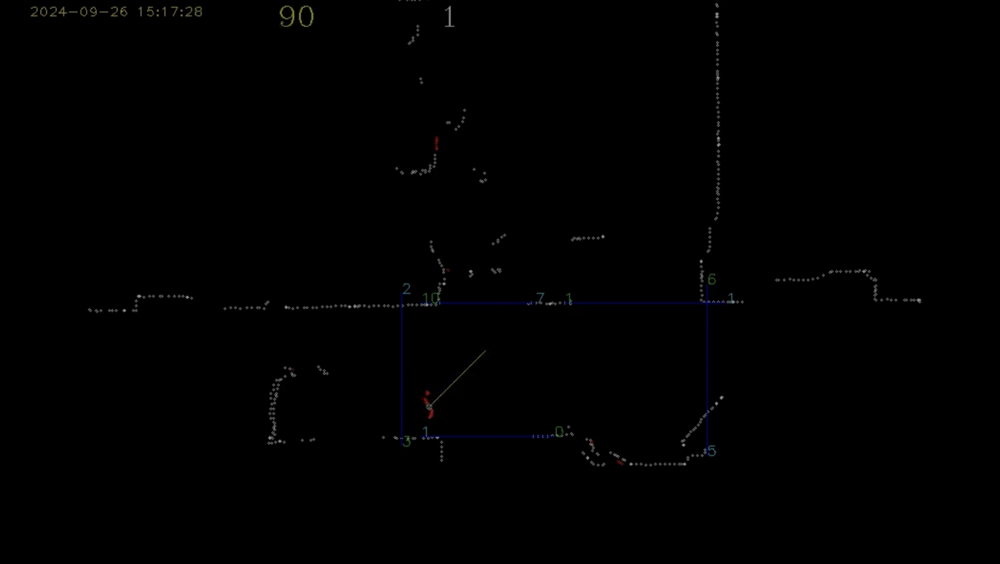
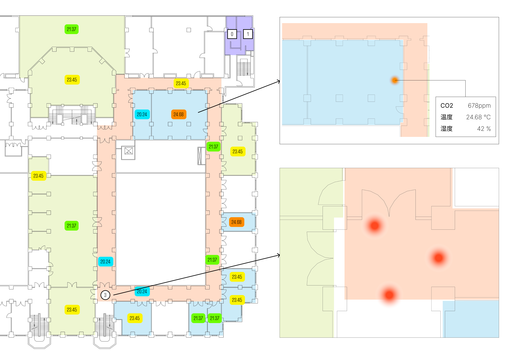

# 工学部１号館における建物情報の取得と公開の実証実験
「既存建物情報のデジタル化による空間価値創造（キャンパスマネジメントDX）」社会連携講座

## 1. 概要
工学部一号館の建築側（東側）を対象に、CO2・温度・湿度などの環境情報や、LiDARを用いた二次元点群データによる人流情報、開閉センサーを用いたトイレの空室状況の情報を取得し、それらを用いて、使用者および管理者視点からの空間価値評価を試みる。 
また、空間価値向上を目指し、リアルタイムな情報を学内限定で可視化することで行動変容を促す。
その様子を人流計測およびアンケート調査などから把握することで、空間価値評価手法とキャンパス・建物マネジメント技術の確立を目指す。

## 2. 目的
- 多様なセンシングの手法を確立することで、空間価値創造に寄与する
- 建築に関する多様なセンシングデータの取得と公開により、データそのものの価値を高める

## 3. 論点
- データは誰のものか？
- 建物のセンシングデータは、管理者と使用者の双方にとって価値がある
- センシングデータを管理者と使用者の双方に還元することで、行動変容を促し、空間価値の向上を目指す

## 4. 具体的な応用可能性（と手法）

### 使用性評価
- 管理者目線によるスペース供給の適正化（デマンド推定）
- 使用者目線による空間価値・居場所の発見（利用したい場所の空き状況把握）

### 快適性評価（温度・湿度・CO2等データと使用状況の組み合わせ）
- 快適性とＧＸの両立を管理者の側から実現（基準値との差の把握から環境制御につなげる）
- 生産性や居心地の向上など、使用者目線による空間価値向上

## 5. センシングとその可視化について

### 5-1. 環境センシング
#### センシング内容
廊下・共有スペース・講義室・会議室・研究室などのCO2・温度・湿度を計測することで、GX的評価や快適性評価に繋げる。

#### 設置するセンサーユニット
Sensirion社のSCD40を使用したセンサーモジュールをESP32（マイコン）に接続。CO2・温度・湿度データをWiFi経由で学内サーバにアップロードする。

### 5-2. 人流センシング
#### センシング内容
廊下や共有スペースの水平面二次元点群データを取得することで、プライバシーを確保しながら、人の動きや流れ、空間の使われ方を把握し、マネジメントや空間価値の向上に繋げる。

#### 設置するセンサーユニット
YDLidar社のTG15をRaspberry Piに接続。2D点群データをWiFi経由で学内サーバにアップロードする。

</image>

</image>

### 5-3. トイレ使用状況
#### センシング内容
トイレの空室状況を開閉センサーによって取得することで、利用され方を把握する。

#### 設置するセンサーユニット
磁石で反応する開閉センサーをRaspberry Piに接続。開閉状態をWiFi経由で学内サーバにアップロードする。

## 6. センシング範囲
工学部一号館の建築側（東側）、一階から三階の廊下・共有スペース・講義室などを対象とする。また、使用者の同意が取れる範囲においては、研究室や院生室なども対象とする。

## 7. データの可視化と公開範囲について

### リアルタイムデータの可視化
- 視覚的にリアルタイムなデータを表示する。
- 各室をズームまたは選択することで、より詳細な値を確認できる。
- UIの具体的な詳細に関しては検討中。
- 平面図はデフォルメされたものを使用する予定。

### 公開範囲について
- 可視化ページを閲覧できるのは、学内ネットワークからのみ
- 取得したデータは、研究目的で使用する場合、要請に応じて提供する。
